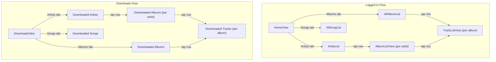

# Browse Tabs + Bulk Download

## Current State

- `HomeView` has two links: Library (artists-only) and Downloads (flat list).
- Browse is strictly artist-first: Artist -> Album -> Track. No way to see all albums or all songs.
- Download buttons only exist on individual track rows in `TrackListView`.
- `DownloadsView` is a flat list split by active/completed. No grouping by artist or album.
- `JellyfinAPIClient` can only fetch albums scoped to an artist, and tracks scoped to an album. No "all albums" or "all tracks" endpoints exist yet.

## Architecture



## Changes by File

### 1. `JellyfinAPIClient.swift` -- New API methods

Add two new fetch methods using the same `/Items` endpoint pattern:

- **`fetchAllAlbums(serverURL:userId:accessToken:musicLibraryId:startIndex:limit:)`** -- `IncludeItemTypes=MusicAlbum`, `Recursive=true`, `ParentId=<musicLibraryId>`, `SortBy=SortName`. No `ArtistIds` filter. Returns `[AlbumSummary]`.
- **`fetchAllTracks(serverURL:userId:accessToken:musicLibraryId:startIndex:limit:)`** -- `IncludeItemTypes=Audio`, `Recursive=true`, `ParentId=<musicLibraryId>`, `SortBy=SortName`. No `ParentId=albumId` filter. Returns `[TrackSummary]`.

Also extend `AlbumSummary` to include `artistName: String?` (decoded from `AlbumArtist` or `Artists[0]` in the Jellyfin response) so album rows can display artist context when shown outside of an artist-scoped view. Similarly, extend `TrackSummary` to include `albumName: String?` and `artistName: String?` (from `AlbumArtist`/`Album` fields).

### 2. `HomeView.swift` -- Tab selector replaces current list

Replace the two NavigationLinks with a `Picker` (segmented style) for Artists / Albums / Songs tabs, plus a toolbar button for Downloads. Each tab shows the corresponding list view inline (not pushed). The selected tab is `@State`.

```
[Artists] [Albums] [Songs]        (segmented picker)
┌─────────────────────────┐
│ Artist A          [DL]  │       (download button per row)
│ Artist B          [DL]  │
│ ...                     │
└─────────────────────────┘
                    [Downloads]   (toolbar / bottom link)
```

### 3. New ViewModels

- **`AllAlbumsViewModel`** -- calls `fetchMusicLibraryId` then `fetchAllAlbums`. Same `State` enum pattern as `BrowseViewModel`.
- **`AllTracksViewModel`** -- calls `fetchMusicLibraryId` then `fetchAllTracks`. Same pattern.

### 4. New Views for "all" lists

- **`AllAlbumListView`** -- mirrors `AlbumListView` but doesn't require an `artistId`. Each row shows album name + artist name + year. Tap pushes `TrackListView`. Download button per row.
- **`AllTrackListView`** -- flat list of every track. Each row shows track name + artist. Tap plays. Download button per row. No drill-down (songs are leaf items).

### 5. Download buttons at every level

Add download buttons to:

- **`ArtistListView` rows** -- tapping downloads ALL tracks for ALL albums by that artist. Requires fetching albums then tracks to enumerate all track IDs and enqueue each.
- **`AlbumListView` rows / `AllAlbumListView` rows** -- tapping downloads ALL tracks in that album. Fetches tracks if needed, enqueues each.
- **`TrackListView` rows** -- already exists, no change needed.
- **New views** (`AllAlbumListView`, `AllTrackListView`) -- same per-row button.

Bulk download helper method on `BackgroundDownloadCoordinator`:
```swift
func enqueueAlbumDownload(albumId:, serverURL:, userId:, accessToken:, albumName:, artistName:)
func enqueueArtistDownload(artistId:, serverURL:, userId:, accessToken:)
```
These async methods fetch the track list from the API, then call `enqueueDownload` for each track.

### 6. Partial-download indicator logic

A shared helper (or computed property on the view) determines the download icon for a container (artist or album):

- **No tracks downloaded** -- plain down-arrow (idle)
- **Some tracks downloaded, some not** -- half-filled arrow or a partial indicator (e.g., `arrow.down.circle.badge.clock`)
- **All tracks downloaded** -- green checkmark
- **Some downloading/queued** -- blue animated indicator

This requires knowing the total track count for a container vs how many have `DownloadTaskState.status == .completed`. For albums, this is the count from `fetchTracks`; for artists, it's the sum across all their albums. The `@Query` of all `DownloadTaskState` rows (already used in `TrackListView`) is filtered by matching `artistName`/`albumName` metadata stored on each `DownloadTaskState` row.

### 7. `DownloadsView.swift` -- Same tab selector, offline-only

Rework to mirror HomeView's tab structure but sourced entirely from `@Query` over `DownloadTaskState`:

- **Artists tab**: `SELECT DISTINCT artistName FROM DownloadTaskState WHERE status IN (completed, downloading, queued)` -- grouped list. Tap pushes a filtered album list.
- **Albums tab**: `SELECT DISTINCT albumName FROM DownloadTaskState WHERE ...` -- grouped list. Tap pushes a filtered track list.
- **Songs tab**: Flat list of all downloaded/downloading tracks. Completed ones are playable; active ones show progress.

Drill-down views reuse the same `DownloadsView` concept but filtered, or are simple inline sub-views.

### 8. `LoginView.swift` -- "Play Downloads" still works

The existing "Play Downloads" `NavigationLink` pushes `DownloadsView`, which now has tabs. No change needed to LoginView itself.

## Files touched (summary)

| File | Change |
|------|--------|
| `JellyfinAPIClient.swift` | Add `fetchAllAlbums`, `fetchAllTracks`; extend `AlbumSummary`/`TrackSummary` with artist/album name |
| `HomeView.swift` | Full rewrite: segmented picker tabs, inline list views, downloads link |
| `ArtistListView.swift` | Add download button per row |
| `AlbumListView.swift` | Add download button per row |
| `DownloadsView.swift` | Full rewrite: tab selector, grouped by artist/album/song |
| `BackgroundDownloadCoordinator.swift` | Add bulk download helpers (album, artist) |
| **New:** `ViewModels/AllAlbumsViewModel.swift` | Fetch all albums |
| **New:** `ViewModels/AllTracksViewModel.swift` | Fetch all tracks |
| **New:** `Views/AllAlbumListView.swift` | All-albums browse with download buttons |
| **New:** `Views/AllTrackListView.swift` | All-tracks browse with download buttons |

## Risks / constraints

- **Large libraries**: fetching ALL tracks at once could be slow/large. The API defaults to 50-item pages. We should paginate or use a reasonable limit (200-500) with a "load more" pattern. Start with a higher limit (200) and defer infinite scroll.
- **Bulk downloads**: downloading an entire artist could be hundreds of tracks. The coordinator already queues beyond 2 concurrent, so this is safe but the queue could get very long. Acceptable for v1.
- **Partial-download indicator accuracy**: relies on `artistName`/`albumName` metadata stored on `DownloadTaskState` rows matching exactly. These are already set by `enqueueDownload`. For bulk downloads, the same metadata flows through.
