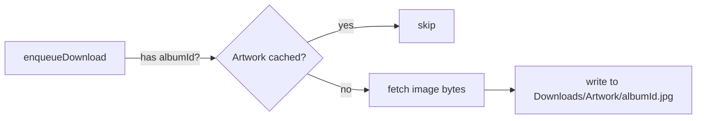

# Offline Album Artwork Caching

## Problem

Artwork is currently fetched live from the Jellyfin server via `AsyncImage(url:)`. When offline, all artwork shows the placeholder icon. Downloading the same image per-track in an album would waste storage and bandwidth.

## Design

Cache artwork **once per album**, keyed by `albumId`. The album's primary image is small (80x80 or 200x200 -- a few KB each), so storage overhead is negligible. The artwork download is a simple foreground `URLSession.shared.data(from:)` call -- not a background download task -- triggered as a side effect when a track download is enqueued, since the server is known-reachable at that moment.



## Storage layout

```
Application Support/Downloads/
  <trackId>.mp3          (existing audio files)
  Artwork/
    <albumId>.jpg         (one per album, ~5-20KB each)
```

## Changes by file

### 1. `DownloadTaskState.swift` -- add `albumId` field

Add `var albumId: String?` to the model. This is the Jellyfin item ID for the album (already available as `TrackSummary.albumId` at every call site), needed to key artwork lookups. All existing `init` calls get `albumId: nil` by default, so no other code breaks.

### 2. `BackgroundDownloadCoordinator.swift` -- artwork download on enqueue

- Add `albumId: String?` parameter to `enqueueDownload(for:url:trackName:artistName:albumName:durationTicks:)` -- threaded through to persist on the `DownloadTaskState` row.
- New private method `cacheArtworkIfNeeded(albumId:serverURL:accessToken:)`:
  - Checks if `Downloads/Artwork/<albumId>.jpg` already exists on disk -- if so, returns immediately (deduplication).
  - Builds the image URL via `JellyfinAPIClient().imageURL(serverURL:itemId:maxWidth:maxHeight:)` with a reasonable size (200x200).
  - Fetches the image data via `URLSession.shared.data(from:)` (foreground, non-blocking to the download queue).
  - Writes the bytes to `Downloads/Artwork/<albumId>.jpg`.
- Called from `enqueueDownload` after persisting the `DownloadTaskState` row, in a `Task` so it doesn't block the download enqueue.
- Also called from `enqueueAlbumDownload` once per album (not once per track in the loop).
- New public helper `cachedArtworkURL(albumId:) -> URL?` that returns the file URL if the artwork file exists on disk, `nil` otherwise. This is the single read-path all views use.

### 3. `NowPlayingView.swift` -- prefer local artwork

Update the artwork section to check for cached local artwork first:
- Look up the current track's `albumId` from the `@Query`'d `DownloadTaskState` row (already fetched for download status).
- If `BackgroundDownloadCoordinator.shared.cachedArtworkURL(albumId:)` returns a file URL, load it via `Image(uiImage:)` from `Data(contentsOf:)` instead of `AsyncImage`.
- Fall back to the existing `AsyncImage(url: track.artworkURL)` when no local artwork exists (online mode).

### 4. `DownloadsView.swift` -- show artwork in offline lists

Update album rows and song rows to show album art from the local cache:
- In `downloadedAlbumsList` and `DownloadedAlbumsForArtistView`: replace the generic `opticaldisc` icon placeholder with a `JellyfinImage`-style view that loads from `cachedArtworkURL(albumId:)`.
- In `downloadedSongsList` completed rows: replace the `music.note` icon with cached artwork when available.
- Requires looking up `albumId` from the `DownloadTaskState` row (hence why we add it to the model).

### 5. `JellyfinImage.swift` -- support local file URLs

`JellyfinImage` currently uses `AsyncImage(url:)` which works for both http and file URLs, but `AsyncImage` may not reliably load `file://` URLs on watchOS. Add a branch: if the URL is a file URL, load synchronously via `UIImage(contentsOfFile:)` and display with `Image(uiImage:)`. Otherwise use the existing `AsyncImage` path.

### 6. Call sites that pass metadata to `enqueueDownload` -- add `albumId`

Every call site that calls `enqueueDownload` or `enqueueAlbumDownload` needs to pass the `albumId`:
- [NowPlayingView.swift](armfin/armfin%20Watch%20App/Views/NowPlayingView.swift) -- `toggleDownload()` needs `albumId` from the `QueueItem` or `DownloadTaskState`.
- [TrackListView.swift](armfin/armfin%20Watch%20App/Views/TrackListView.swift) -- `downloadTrack()` has `track.albumId` from `TrackSummary`.
- [AllTrackListView.swift](armfin/armfin%20Watch%20App/Views/AllTrackListView.swift) -- same pattern.
- `enqueueAlbumDownload` already has `albumId` -- just needs to pass it through to `enqueueDownload` and call `cacheArtworkIfNeeded` once before the track loop.

### 7. `QueueItem` -- add `albumId` field

Add `let albumId: String?` so `NowPlayingView.toggleDownload()` can pass it through to `enqueueDownload`. Every site that constructs a `QueueItem` already has access to `track.albumId` or the album context.

## What this does NOT do

- No new SwiftData model for artwork (plain file on disk, keyed by filename -- SwiftData overhead is unnecessary for a simple image cache).
- No eviction policy for artwork (tiny files, tied 1:1 to album downloads; cleaned up naturally when downloads are removed in a future milestone).
- Artwork download does NOT count against the 2-concurrent-download cap (it's a tiny foreground fetch, not a background download task).
